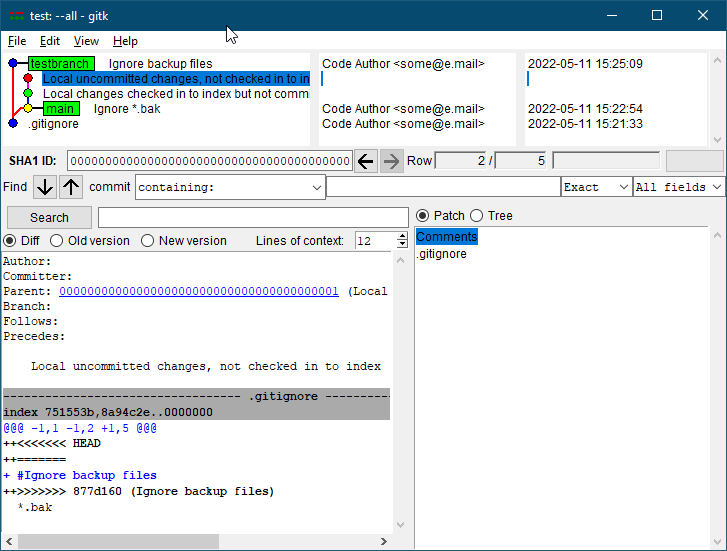
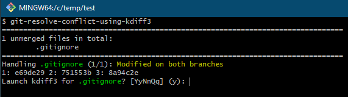
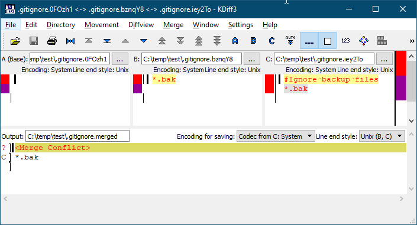
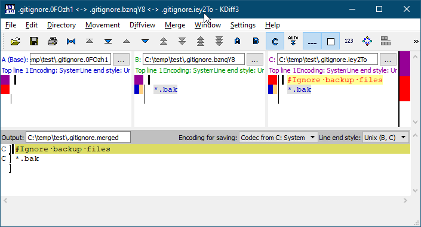
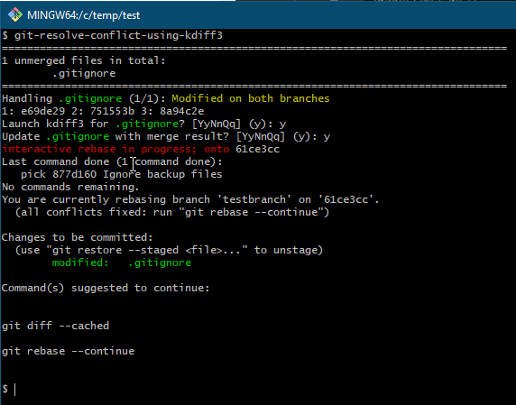

# What is this?

This is a script that will launch [KDiff3](http://kdiff3.sourceforge.net/) with
a 3-way merge view to resolve the conflicts.

## Benefits

By default git will add text conflict markers in the file with conflict, but
that is only giving context from **two** versions, having a full **3-way** context
is vastly superior (as well as being graphical is much easier to easier to
review).

And by using KDiff3 you will able to both review (and override) all the
automatically resolved conflicts. Being able to see which versions that were
selected automatically can often be a big help in determing how to resolve
conflicts that were not automatically resolved.

# Usage/example

## Create repository with a conflict

Modifying `.gitignore` on two branches, same change but one of them
also adds a comment.

```bash
$ git init
Initialized empty Git repository in C:/Temp/test/.git/
$ touch .gitignore
$ git add .gitignore
$ git ci -m .gitignore
[main (root-commit) 7a3154e] .gitignore
 1 file changed, 0 insertions(+), 0 deletions(-)
 create mode 100644 .gitignore
$ echo '*.bak' >> .gitignore
$ git add .gitignore
$ git ci -m "Ignore *.bak"
[main 61ce3cc] Ignore *.bak
 1 file changed, 1 insertion(+)
$ git checkout -b testbranch HEAD^
Switched to a new branch 'testbranch'
$ (echo '#Ignore backup files'; echo '*.bak' ) >> .gitignore
$ git add .gitignore
$ git ci -m "Ignore backup files"
[testbranch 877d160] Ignore backup files
 1 file changed, 2 insertions(+)
$ git rebase main testbranch
Auto-merging .gitignore
CONFLICT (content): Merge conflict in .gitignore
error: could not apply 877d160... Ignore backup files
hint: Resolve all conflicts manually, mark them as resolved with
hint: "git add/rm <conflicted_files>", then run "git rebase --continue".
hint: You can instead skip this commit: run "git rebase --skip".
hint: To abort and get back to the state before "git rebase", run "git rebase --abort".
Could not apply 877d160... Ignore backup files
$ gitk --all &
[1] 26349
$
```



## Resolving the conflict

Running the script will present a list of the files that has conflict and ask
to launch kdiff3:



Answering yes launches KDiff3:



and by using KDiff3's *manual diff allignment* on the `*.bak` lines we can get
KDiff3 to resolve this automatically:



Saving and quiting KDiff3, the script asks if you are satisfied with the result
and want to add the file:



With all conflicts resolved, you can run `git rebase --continue`.

# Installation

## Linux/FreeBSD/unix

Copy `git-resolve-conflict-using-kdiff3` and `git-resolve-conflict-using-kdiff3.pl`
into a directory that is included in your `PATH` environment variable.

E.g.

```bash
cp git-resolve-conflict-using-kdiff3* $HOME/bin/.
```

The script has one perl library dependency, [`String::ShellQuote`](https://metacpan.org/pod/String::ShellQuote).
On Fedora/Centos/RedHat systems this can be installed with the package
`perl-String-ShellQuote` (and in this case you can probably just use the `*.pl`
file directly).

Alternatively you can use the embedded version in this repository by copying
the `dependencies/String` directory to the same directory that the script is
copied to.

E.g.

```bash
cp -r dependencies/String $HOME/bin/.
```

## Windows

Copy `git-resolve-conflict-using-kdiff3` and `git-resolve-conflict-using-kdiff3.pl`
into a directory that is included in your `PATH` environment variable.

E.g.

```bash
cp git-resolve-conflict-using-kdiff3* $HOME/bin/.
```

This script works both with [cygwin](https://www.cygwin.com/) and the `Git Bash`
window from [git for windows](https://www.git-scm.com/download/win).

The script has one perl library dependency, [`String::ShellQuote`](https://metacpan.org/pod/String::ShellQuote)
which is not available directly. So copy the `dependencies/String` directory
to the same directory that the script is copied to.

E.g.

```bash
cp -r dependencies/String $HOME/bin/.
```

Also copy the `kdiff3` script to launch KDiff3 (modify it if not installed as
`C:\Program Files\KDiff3\kdiff3.exe`).

E.g.

```bash
cp helpers/kdiff3 $HOME/bin/.
```

# Trouble shooting

Make sure that the scripts have the execute bit set (e.g.
`chmod +x $HOME/bin/git-resolve-conflict-using-kdiff3`).

# Background/history

Q: Have you not heard about mergetool?

A: Yes, but this is a general tool for any command that can result in
conflicts, not just `merge` e.g. also `revert`, `cherry-pick`, `rebase`
(and `stash apply/pop`).

I think mergetool perhaps handles some of these now as well, but I am quite
sure it did not when I started writing this script many, many years ago.
But even if there is a 100% overlap in support, I think this script has better
behaviour.
